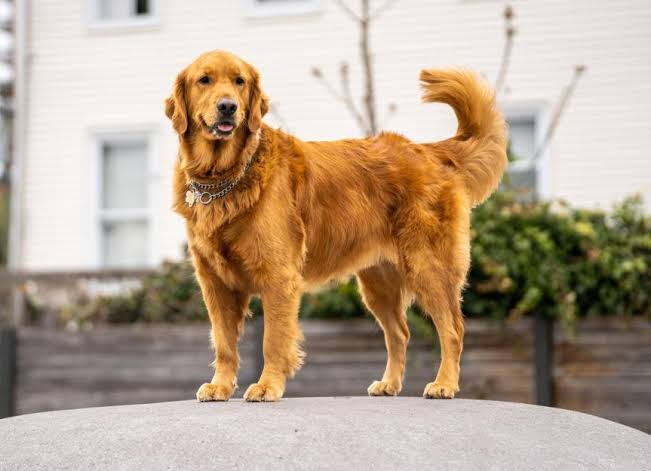

# 🐾 Cat & Dog Classifier

A machine learning project that classifies images as either cats or dogs. This application uses a pre-trained model to predict the result with high accuracy.


---

## 🚀 Features

- Upload an image to classify it as a cat or dog.
- High-accuracy predictions using a pre-trained model.
- Interactive web interface built with FastAPI.
- Easily train or fine-tune the model using the provided dataset.

---

## 📂 Dataset

The project uses a dataset containing labeled images of cats and dogs. You can download the dataset from the following link:

[Download Dataset](https://download.microsoft.com/download/3/E/1/3E1C3F21-ECDB-4869-8368-6DEBA77B919F/kagglecatsanddogs_5340.zip)

---

## 🌐 Try It on Google Colab

Experiment with the model and the project setup directly on Google Colab:

[](https://colab.research.google.com/drive/1wsHHF8u3FgKRPWoTZnumRGH9mzkWc3Ov?usp=sharing)

---

## 🖼️ Image Examples

### Example 1: Cat


### Example 2: Dog


---

## 🛠️ Installation and Setup

Follow these steps to set up and run the project locally:

### Prerequisites

- Python 3.8 or later
- Virtual environment (optional but recommended)
- `pip` for package management

### 1. Clone the Repository

```bash
git clone https://github.com/MasakDirt/cat_dog.git
cd cat-dog-classifier
```

### 2. Create a Virtual Environment (Optional)

```bash
python -m venv venv
source venv/bin/activate  # On Windows: venv\Scripts\activate
```

### 3. Install Dependencies

```bash
pip install -r requirements.txt
```

### 4. Run the Application

```bash
uvicorn app:app --reload
```

The application will be available at `http://127.0.0.1:8000`.

---


## 🖥️ How to Use the Web Interface

1. Open the browser and go to `http://127.0.0.1:8000`.
2. Upload an image of a cat or a dog.
3. Click "Check" to classify the image.
4. See the prediction result and confidence percentage.
